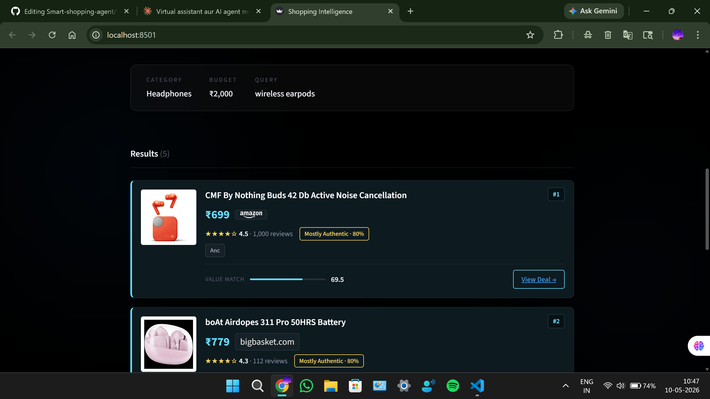

<div align="center">


<br/>

[](https://python.org)
[](https://streamlit.io)
[](https://groq.com)
[](https://serpapi.com)

</div>

---

<div align="center">

## What is SmartShop AI?

</div>

SmartShop is a **voice + text powered AI shopping agent** built for Indian e-commerce.

Speak or type in plain English — *"best gaming laptop under 30000"* — and the agent fetches live products from **Amazon and Flipkart**, detects fake reviews using Groq AI, scores everything by real value-for-money, and presents the best options in a **Jarvis-style dark UI** with animated rings and glowing orb.

No sponsored results. No fake ratings. Just the best deal.

---

## Preview

<div align="center">
  
  <br/><br/>
  
</div>

---

## How It Works

<div align="center">

```
┌─────────────────────────────────────────────────────────────────┐
│                                                                 │
│   You speak or type your query                                  │
│                        │                                        │
│                        ▼                                        │
│   Groq AI (Llama 3.3 70B) parses intent                        │
│   budget: 30,000  |  category: gaming laptop                   │
│                        │                                        │
│                        ▼                                        │
│   SerpAPI fetches live listings                                 │
│   Amazon ──────────────┼────────────── Flipkart                 │
│                        │                                        │
│                        ▼                                        │
│   Groq AI checks review authenticity                            │
│   Verified Genuine · 96%                                        │
│   Suspicious · 31%                                              │
│                        │                                        │
│                        ▼                                        │
│   Value score = rating + budget fit + authenticity              │
│                        │                                        │
│                        ▼                                        │
│   Top 5 results with specs, scores, and buy links               │
│                                                                 │
└─────────────────────────────────────────────────────────────────┘
```

</div>

---

## Features

<div align="center">

| Feature | Description |
|---|---|
| **Voice Search** | Click mic, speak, silence detected, auto search |
| **Live Product Data** | Real-time results from Amazon and Flipkart |
| **Fake Review Detector** | Groq AI scores review authenticity per product |
| **Value Ranking** | Scored on budget fit, rating, volume, authenticity |
| **Jarvis-style UI** | Dark theme, glowing orb, animated teal rings |

</div>

---

## Tech Stack

<div align="center">

| Layer | Technology |
|---|---|
| UI | Streamlit |
| AI Brain | Groq — Llama 3.3 70B *(free)* |
| Voice | Web Speech API — browser native |
| Products | SerpAPI — Google Shopping engine |
| Backend | Python 3.10+ |
| Config | python-dotenv |

</div>

---

## Project Structure

```
smart-shopping-agent/
│
├── app.py                ← Streamlit UI + main pipeline
├── agent.py              ← Intent parsing, scoring, ranking
├── scraper.py            ← SerpAPI product fetch + fallback
├── review_analyzer.py    ← Fake review detection logic
│
├── requirements.txt
├── .env.example
│
└── .streamlit/
    └── config.toml       ← Dark theme config
```

---

## Getting Started

### Step 1 — Clone the repo

```bash
git clone https://github.com/your-username/smart-shopping-agent.git
cd smart-shopping-agent
```

### Step 2 — Create virtual environment

**Windows (PowerShell):**
```powershell
python -m venv .venv
Set-ExecutionPolicy -Scope Process -ExecutionPolicy RemoteSigned
.\.venv\Scripts\Activate.ps1
```

**macOS / Linux:**
```bash
python -m venv .venv
source .venv/bin/activate
```

### Step 3 — Install dependencies

```bash
pip install -r requirements.txt
```

### Step 4 — Configure API keys

```bash
cp .env.example .env
```

Open `.env` and add your keys:

```env
GROQ_API_KEY=your_groq_key_here
SERPAPI_API_KEY=your_serpapi_key_here
```

> **Free API keys:**
> - Groq → [console.groq.com](https://console.groq.com) — completely free, no card needed
> - SerpAPI → [serpapi.com](https://serpapi.com) — 100 free searches/month
>
> Both are optional — app works in demo mode without them.

### Step 5 — Run

```bash
streamlit run app.py
```

Visit `http://localhost:8501`

---

## Deploy

### Streamlit Community Cloud *(recommended — free)*

1. Push this repo to GitHub
2. Go to [share.streamlit.io](https://share.streamlit.io) → **New app**
3. Select your repo → main file: `app.py`
4. Add secrets: `GROQ_API_KEY` and `SERPAPI_API_KEY`
5. Click **Deploy**

### Render

```bash
# Build command
pip install -r requirements.txt

# Start command
streamlit run app.py --server.port $PORT --server.address 0.0.0.0
```

Add `GROQ_API_KEY` and `SERPAPI_API_KEY` in Render environment variables.

---

## Troubleshooting

| Problem | Fix |
|---|---|
| No results showing | Check `SERPAPI_API_KEY` and quota at [serpapi.com/dashboard](https://serpapi.com/dashboard) |
| Groq not responding | Verify `GROQ_API_KEY` is correct in `.env` |
| Voice not working | Use Chrome or Edge — Firefox doesn't support Web Speech API |
| Streamlit not found | Activate virtual environment first |

---

## Contributing

```bash
git checkout -b feature/your-feature
git commit -m "feat: add your feature"
git push origin feature/your-feature
# Open a Pull Request
```

<div align="center">


*If this helped you, drop a ⭐ on the repo.*

</div>
